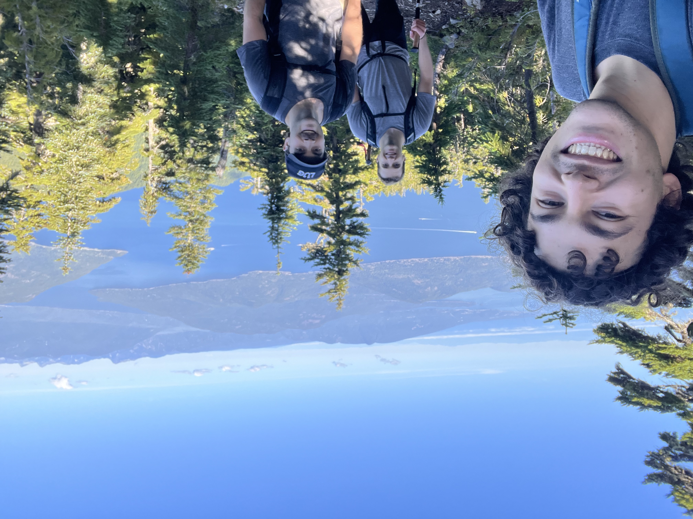

My first few weeks of MDS have been a busy, but fun, blur. From landing in Vancouver just a few days before orientation to now, it feels like months already. I have been fortunate to meet such amazing and interesting people and it has made the transition so much more enjoyable. The picture above is of me and two program friends as we summitted Mt.Brunswick

The first week of classes felt daunting, but working my way through the worksheets and labs helped me feel like I actually was in control. The program is a wild and rushing river. I can't stop the flow of it, but I can learn to flow with it. Get as much done each day, keep well rested and fed, believe in myself, and I will find that I have passed through the rapids in no time!